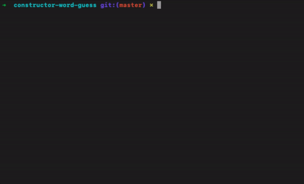

# Constructor Word Guess Game

This is a Command Line Interface (CLI) word guess game.

## How it works
The game randomly selects a fruit from a list, the player guesses a letter, if correct it will replace the underscore
with the correct letter. The player wins when they have guessed all the letters. At that time the player will be asked
if they would like to play again.

## Demo

## Installation

* Navigate to the folder where you want to clone the app then run the following command.

 ` git@github.com:torqie/constructor-word-guess.git `

* This command will create a folder called constructor-word-guess, and the project file will be within that folder. 
Let's go ahead and change into that directory now.

` cd constructor-word-guess `

* Next we need to install the npm dependencies. Run the following command in the terminal.

` npm install `

* Great! That is all that is require for installation  for this node app.

## How To Use

Now that you have the node app installed lets go ahead and run the app with the following command

` node index.js `

Now the game has begun... begin by typing a letter and hitting enter.. keep guessing until you get the word right.

## Technologies Used
* Javascript
* Node

